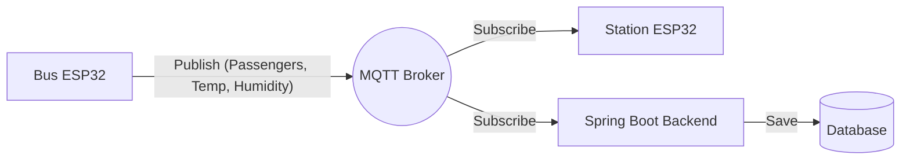

<div align="center">


# NextStop: Smart Bus & Station IoT Ecosystem 🚌📡

[](https://spring.io/)
[](https://www.espressif.com/)
[](https://mqtt.org/)
[](#)

*An event-driven, end-to-end IoT public transportation system featuring real-time telemetry, sensor integration, and data persistence.*

</div>

## 📌 Overview

**NextStop** is a comprehensive IoT (Internet of Things) project that digitizes the communication between public transport vehicles and transit stations. The hardware layer consists of two **ESP32** microcontrollers (Smart Bus and Smart Station) communicating asynchronously via the MQTT protocol. The software layer features a **Spring Boot** backend architecture that listens to this data stream, processes the telemetry, and persists it into a database.

## 🏗️ System Architecture

The project relies on a decoupled, asynchronous architecture separating the hardware sensors from the data processing logic:

1. **Edge Devices:** ESP32 microcontrollers deployed at the station and inside the bus.
2. **Message Broker:** An MQTT Broker for low-latency, reliable, and lightweight machine-to-machine (M2M) communication.
3. **Backend Service:** A Java/Spring Boot service that subscribes to MQTT topics, processes incoming JSON payloads, and saves them to the database.


## ⚙️ Hardware Components & Setup

The **Smart Bus (Bus ESP32)** is equipped with an extensive network of sensors and actuators to autonomously manage passenger experience, safety, and vehicle climate:

* **Microcontroller:** ESP32
* **Door Control System:** * 2x Servo Motors (Front and Rear doors).
  * 1x Physical Button for manual door operation.
* **Passenger Tracking & Ticketing:**
  * **RFID Reader & Buzzer:** Handles passenger boarding and provides audio feedback upon successful/failed card reads.
  * **2x Ultrasonic Sensors (HC-SR04):** Positioned at the exit doors to detect alighting passengers.
* **Smart HVAC (Climate Control):** * **DHT11 Sensor:** Measures internal temperature and humidity.
  * **DC Motor & Fan:** Automated cooling unit triggered by ambient temperature.
* **Signaling & Lighting:**
  * **"Stop Request" System:** 1x Request Button and 1x Red Warning LED.
  * **Vehicle Exterior Lights:** 2x Yellow LEDs (Headlights) and 2x Red LEDs (Taillights).

## 🚀 Core Features & Business Logic

The system operates based on the following autonomous rules, transforming physical events into digital data:

### 1. Real-Time Telemetry Synchronization
While in transit, the bus periodically reads the **current passenger count**, **temperature**, and **humidity**. This data is published via the MQTT Broker to both the Smart Station (for passenger information displays) and the Spring Boot backend (for historical logging).

### 2. Autonomous HVAC (Climate Control)
When the DHT11 sensor detects that the internal vehicle temperature has exceeded **28°C**, the ESP32 automatically triggers the DC motor, turning on the cooling fan. Once the temperature drops to optimal levels, the fan shuts off autonomously.

### 3. Failsafe Passenger Tracking
* **Boarding:** Passengers scan their RFID cards at the front door. The buzzer sounds, and the internal passenger counter increments.
* **Alighting:** The 2x ultrasonic sensors detect exiting passengers. However, **the counter only decreases when the doors (servo motors) are actively open.** Any movement detected while the doors are closed is ignored, preventing false triggers and ensuring highly accurate passenger counts.

### 4. Smart "Stop Request" Integration
* When a passenger presses the stop button, the **Red "Stop Requested" LED** illuminates inside the cabin.
* When the bus arrives at the station and the driver presses the door control button (opening the servo motors), the system recognizes that passengers can safely alight and **automatically turns off the Red LED.**

## 💻 Backend & Data Persistence (Spring Boot)

To ensure the persistence of data generated by the IoT ecosystem and to lay the groundwork for future analytics (e.g., admin dashboards), a **Spring Boot** application is utilized. The backend service:
* Acts as an integrated client connected directly to the MQTT broker.
* Asynchronously listens to continuous telemetry streams (`bus/telemetry`, `bus/events`).
* Parses incoming JSON payloads and stores the structured data into a relational database (via JPA/Hibernate entities and repositories).

## 🛠️ Getting Started

### Embedded System (Arduino IDE / PlatformIO)
1. Open the source code located in the `embedded/` directory.
2. Install the required libraries for the ESP32 (`PubSubClient`, `DHT sensor library`, `MFRC522`, `ESP32Servo`).
3. Update the **WiFi SSID**, **Password**, and **MQTT Broker IP** inside the configuration files to match your local network.
4. Wire the sensors, servos, and LEDs according to the pin definitions in the code, and flash the firmware to the ESP32 boards.

### Spring Boot Backend
1. Navigate to the `backend/` directory.
2. Configure your MQTT connection settings and Database credentials (MySQL/PostgreSQL) inside the `application.properties` or `application.yml` file.
3. Build and run the project using Maven:
   ```bash
   mvn spring-boot:run


Contributors: Serkan AYAŞAN, Atakan KAHRAMAN, Olcay KARAHASAN, Alp KAYA
